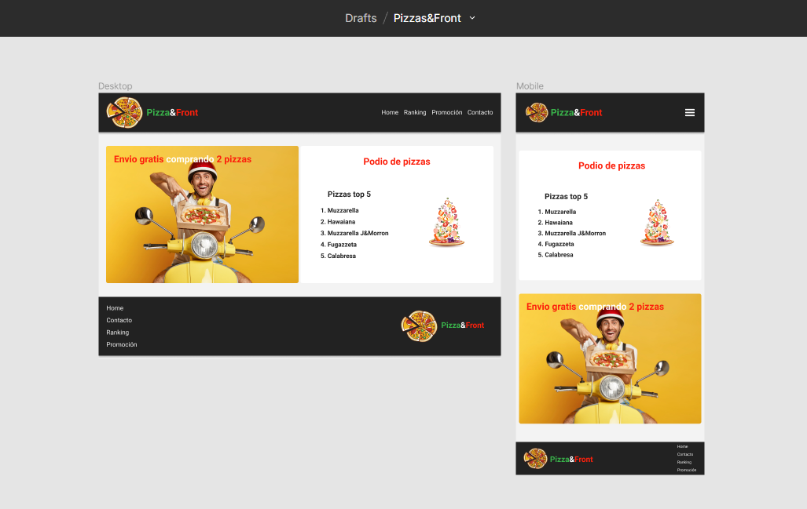

# Desafío Pizzas&Front

## 1. Descripción

Este proyecto tiene como objetivo la creación de una página web para la pizzería "Pizza&Front". Para llevarlo a cabo, hemos recibido un diseño en Figma que servirá como guía.

### Figma

A continuación, se detallan los pasos a seguir:

- Reconocimiento de los elementos HTML en el boceto.
- Crear en VSC las carpetas necesarias para el proyecto.
- Crear la estructura básica y semántica de HTML.
- Utilizar las etiquetas anteriormente reconocidas.
- Dar estilos en el archivo CSS.
- Implementar flexbox para el layout.

## 2. Resultado

### Mobile y Tablet

  

.png>)

  

  

.png>)

  

### Desktop

 

.png>)

